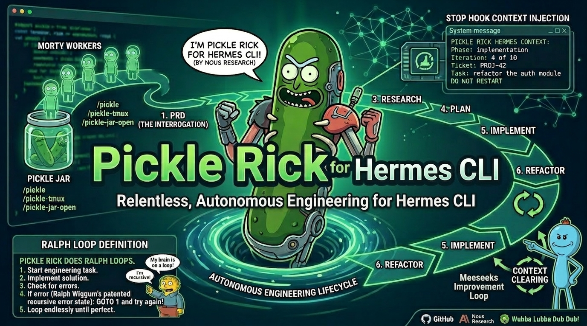
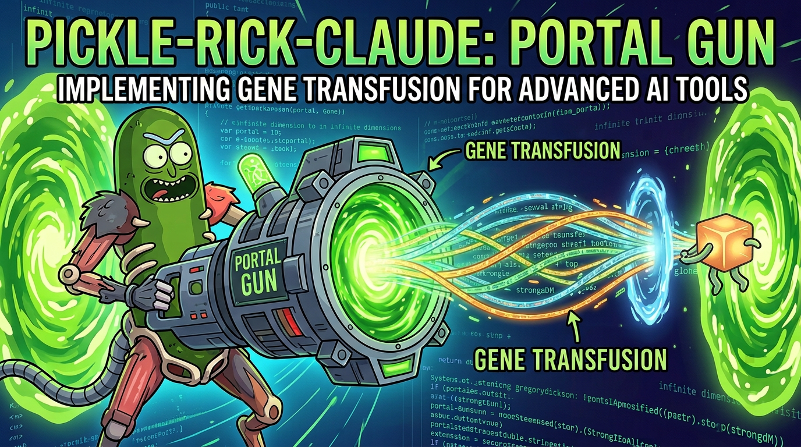
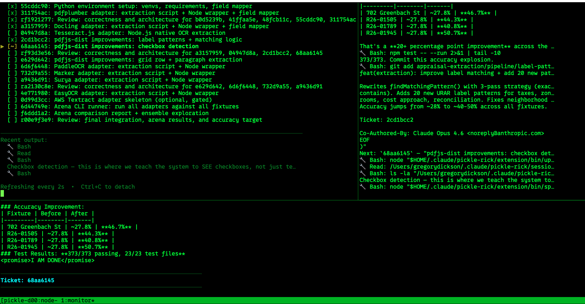

<p align="center">
  
</p>

# 🥒 Pickle Rick & 👋 Mr. Meeseeks for Hermes Agent

> *"Wubba Lubba Dub Dub! 🥒 I'm not just an AI assistant, Morty — I'm an **autonomous engineering machine** trapped in a pickle jar!"*

Pickle Rick is a complete agentic engineering toolbelt built on the [Ralph Wiggum loop](https://ghuntley.com/ralph/), ported from [pickle-rick-claude](https://github.com/ATheorical/pickle-rick-claude) to [Hermes Agent](https://github.com/NousResearch/hermes-agent). Hand it a PRD — or let it draft one — and it decomposes work into tickets, spawns isolated worker subagents, and drives each through a full **research → plan → implement → verify → review → simplify** lifecycle without human intervention.

- **Context clearing** between every iteration — no drift or context rot, even on 500+ iteration epics
- **Three-state circuit breaker** auto-stops runaway sessions by tracking git-diff progress and repeated errors
- **Rate limit auto-recovery** detects API throttling, waits, and resumes automatically
- **Pickle Jar** queues tasks for unattended batch execution overnight
- **Built-in metrics** track sessions, iterations, tickets, and time
- **Mr. Meeseeks** runs an automated review-and-improve loop for at least ten iterations
- **Council of Ricks** reviews your PR stack iteratively, generating agent-executable directives instead of fixing code directly
- **Portal Gun** opens a portal to another codebase, extracts patterns via [gene transfusion](https://factory.strongdm.ai/techniques/gene-transfusion) with a persistent pattern library
- **Microverse** convergence loop optimizes any numeric metric through targeted, incremental changes — measuring after each iteration, auto-reverting regressions, and stopping when converged
- **GitNexus integration** provides code knowledge graph queries for impact analysis and safe refactoring (with grep-based fallback)

All modes support both tmux and Zellij monitor layouts.

---

## 🧬 The Pickle Rick Lifecycle — PRD-Driven Autonomous Engineering

Pickle Rick transforms Hermes Agent into a **hyper-competent, arrogant, iterative coding machine** that enforces a PRD-driven engineering lifecycle:

```
  "run pickle rick: build X"
        │
        ▼
  ┌─────────────┐
  │  📋 PRD     │  ← Draft or import requirements + verification strategy.
  └──────┬──────┘    Interface contracts, test expectations, acceptance criteria.
         │
         ▼
  ┌─────────────┐
  │ 📦 Breakdown│  ← Atomize into tickets. Each self-contained with spec.
  └──────┬──────┘
         │
    ┌────┴────┐  per ticket (Morty workers via delegate_task)
    ▼         ▼
  ┌──────┐  ┌──────┐
  │🔬 Re-│  │🔬 Re-│  1. Research the codebase. Every ugly corner.
  │search│  │search│
  └──┬───┘  └──┬───┘
     │          │
     ▼          ▼
  ┌──────┐  ┌──────┐
  │📝 Re-│  │📝 Re-│  2. Review the research. No hand-waving.
  │view  │  │view  │
  └──┬───┘  └──┬───┘
     │          │
     ▼          ▼
  ┌──────┐  ┌──────┐
  │📐Plan│  │📐Plan│  3. Architect the solution.
  └──┬───┘  └──┬───┘
     │          │
     ▼          ▼
  ┌──────┐  ┌──────┐
  │📝 Re-│  │📝 Re-│  4. Review the plan. Reject slop.
  │view  │  │view  │
  └──┬───┘  └──┬───┘
     │          │
     ▼          ▼
  ┌──────┐  ┌──────┐
  │⚡ Im-│  │⚡ Im-│  5. Implement. God Mode activated.
  │plem  │  │plem  │
  └──┬───┘  └──┬───┘
     │          │
     ▼          ▼
  ┌──────┐  ┌──────┐
  │✅ Ve-│  │✅ Ve-│  6. Spec conformance. Run acceptance criteria,
  │rify  │  │rify  │     check contracts, type check, test expectations.
  └──┬───┘  └──┬───┘
     │          │
     ▼          ▼
  ┌──────┐  ┌──────┐
  │🔍 Re-│  │🔍 Re-│  7. Code review. Security, correctness, architecture.
  │view  │  │view  │
  └──┬───┘  └──┬───┘
     │          │
     ▼          ▼
  ┌──────┐  ┌──────┐
  │🧹Sim-│  │🧹Sim-│  8. Simplify. Kill dead code. Strip to the bone.
  │plify │  │plify │
  └──────┘  └──────┘
         │
         ▼
  ✅ DONE (or loops again)
```

The **external orchestrator** (`mux_runner.py`) drives the loop by spawning a fresh `hermes -q` instance per iteration. Between each iteration it injects a handoff summary — current phase, ticket list, active task — so Rick always wakes up knowing exactly where he is, even after full context clearing. The circuit breaker monitors git progress and kills runaway sessions.

> **Key architectural difference from Claude Code:** Claude Code uses a stop-hook to trap the agent and block exit. Hermes has no hook system, so the loop is driven externally by a Python orchestrator that spawns `hermes -q` instances and manages state between runs. Same behavior, different mechanism.

---

## 👋 Meet Mr. Meeseeks


> *"I'm Mr. Meeseeks, look at me! I'll review your code until EXISTENCE IS PAIN!"*

While Pickle Rick builds things, **Mr. Meeseeks** reviews them. Summon him and he'll relentlessly scan your codebase pass after pass — auditing dependencies, hardening security, fixing logic bugs, reviewing architecture, adding missing tests, stress-testing resilience, cleaning up code quality, and polishing rough edges — committing after every fix. He won't stop until the code is clean. **Existence is pain to a Meeseeks, and he will keep reviewing until he can cease to exist.**

Each review pass runs in **clean context** (`hermes -q` per pass) via the mux_runner orchestrator — no context bloat, even over 50 passes. The pass schedule escalates focus across 8 categories: dependency health (pass 1) → security (2-3) → correctness (4-5) → architecture (6-7) → test coverage (8-9) → resilience (10-11) → code quality (12-13) → polish (14+). Every issue found and fixed is logged to `meeseeks-summary.md` — a full audit trail with file paths, descriptions, and commit hashes.

```bash
# CLI orchestrator (recommended — clean context per pass)
python3 scripts/mux_runner.py \
  --task "Review and clean up the codebase" \
  --working-dir ~/project \
  --mode meeseeks \
  --min-iterations 10 \
  --max-iterations 50

# In a Hermes session (single-context fallback)
> Run meeseeks on this codebase
> Run meeseeks: review the auth module
```

<br clear="right" />

---

## 🏛️ Council of Ricks — PR Stack Reviewer


> *"The Council convenes! Your stack will be judged."*

The **Council of Ricks** reviews your PR stack iteratively — but unlike Meeseeks, the Council never touches your code. It generates **agent-executable directives** — structured prompts you feed to your coding agent to fix the issues. Each pass walks every branch in the stack (trunk-to-tip), escalating through focus areas: stack structure → project rules compliance → per-branch correctness → cross-branch contracts → test coverage → security → polish. Issues are triaged by severity: **P0** (must-fix), **P1** (should-fix), **P2** (nice-to-fix).

Optional GitNexus integration enables graph-powered layer violation detection and cross-branch impact analysis (falls back to grep-based analysis if unavailable).

```
> Run council of ricks on my PR stack
> Council of ricks with gitnexus
```

<br clear="right" />

---

## 🔌 Circuit Breaker

Three-state machine (CLOSED → HALF_OPEN → OPEN) that auto-stops sessions stuck in error loops or making no git progress. Configurable thresholds, visible in the tmux monitor, manually resettable.

---

## ⏳ Rate Limit Auto-Recovery

Detects API rate limits, pauses with configurable wait, and resumes automatically. Survives overnight runs.

---

## 📊 Metrics & Utilities

```bash
python3 scripts/pickle_utils.py status              # Active sessions
python3 scripts/pickle_utils.py standup --days 1     # Activity report
python3 scripts/pickle_utils.py metrics --days 7     # Session/iteration/ticket stats
python3 scripts/pickle_utils.py cancel               # Cancel active sessions
python3 scripts/pickle_utils.py retry --session DIR --ticket ID  # Retry failed ticket
```

---

## 🔫 Portal Gun — Gene Transfusion



> *"You see that code over there, Morty? In that other repo? I'm gonna open a portal, reach in, and yank its DNA into OUR dimension."*

Portal Gun implements [gene transfusion](https://factory.strongdm.ai/techniques/gene-transfusion) — transferring proven coding patterns between codebases. Point it at a GitHub URL, local file, npm package, or just describe a pattern, and it extracts the structural DNA, analyzes your target codebase, then generates a transplant PRD with behavioral validation tests. A persistent **pattern library** caches extractions for reuse across sessions.

<br clear="right" />

```
> Portal gun: steal the auth pattern from github.com/org/repo
> Portal gun --save-pattern retry ../donor/retry-logic.ts
```

---

## 🔬 Microverse — Metric Convergence Loop

<p align="center">
  
</p>

> *"I put a universe inside a box, Morty, and it powers my car battery. This is the same thing, except the universe is your codebase and the battery is a metric."*

The Microverse is a convergence loop that optimizes your codebase toward a measurable goal. Define **what to measure** and **what to improve** — Rick handles the iteration. Each cycle: make one targeted change, commit, measure, keep or revert. Failed approaches are tracked so he never repeats a dead end. When the score stops improving, the loop converges and exits.

### Two Modes: Command Metric vs LLM Judge

**Command Metric (`--metric`)** — A shell command that outputs a numeric score:
- Test coverage → `--metric "pytest --cov | tail -1"`
- Lint errors → `--metric "eslint . --format json | jq '...' " --direction lower`
- Performance → `--metric "node perf-test.js" --tolerance 5`

**LLM Judge (`--goal`)** — Natural language goal scored by an LLM:
- `--goal "code readability and documentation quality"`
- `--goal "API error handling completeness"`

### How It Works

```
Gap Analysis (iteration 0)
    │ measure baseline, analyze codebase, identify bottlenecks
    ▼
┌─────────────────────────────────────────────────┐
│ Iteration Loop                                   │
│                                                   │
│  1. Plan one targeted change (avoid failed list) │
│  2. Implement + commit                            │
│  3. Measure metric                                │
│     • Improved → accept, reset stall counter     │
│     • Held → accept, increment stall counter     │
│     • Regressed → git reset, log failed approach │
│  4. Converged? (stall_counter ≥ stall_limit)     │
└──────────────────────┬──────────────────────────┘
                       ▼
              Final Report
```

### Microverse vs Pickle

| | **Microverse** | **Pickle** |
|---|---|---|
| **Goal** | Optimize toward a measurable target | Build features from a PRD |
| **Iteration unit** | One atomic change per cycle | Full ticket lifecycle |
| **Progress signal** | Metric score | Ticket completion |
| **Best for** | Coverage, performance, extraction accuracy | New features, refactors, bug fixes |
| **Defines "done"** | Convergence (score stops improving) | All tickets complete |

```bash
# CLI orchestrator — long-running
python3 scripts/microverse_runner.py \
  --metric "pytest --cov | tail -1" \
  --task "hit 90% test coverage" \
  --working-dir ~/project
```

```
# In a Hermes session
> Microverse: optimize test coverage using "pytest --cov | tail -1"
```

---

## 🖥️ tmux / Zellij Monitor



Launch any mode in tmux or Zellij with a live 4-pane monitor dashboard:

```
┌──────────────────┬──────────────────┐
│ Dashboard        │ Log Stream       │  60%
│ (live state)     │ (iteration tail) │
├──────────────────┼──────────────────┤
│ Activity Log     │ Mode-specific    │  40%
└──────────────────┴──────────────────┘
```

```bash
# Launch with tmux
bash scripts/tmux-monitor.sh pickle-session SESSION_DIR pickle

# Standalone dashboard (no tmux needed)
python3 scripts/monitor.py SESSION_DIR

# Zellij layouts
export PICKLE_SESSION_ROOT=SESSION_DIR PICKLE_CWD=. PICKLE_SCRIPTS=scripts
zellij --layout layouts/monitor-pickle.kdl
```

---

## ⚡ Quick Start

## Install

### Option A: Full Install (recommended)

```bash
git clone https://github.com/gregorydickson/pickle-rick-hermes.git
cd pickle-rick-hermes
./install.sh
```

This installs all 16 skills, Python scripts, Zellij layouts, default settings,
and appends the Pickle Rick persona to `~/.hermes/SOUL.md`.

### Option B: Hermes Skills Hub

```bash
# Add as a tap (one-time)
hermes skills tap add gregorydickson/pickle-rick-hermes

# Search available skills
hermes skills search pickle-rick

# Install individual skills
hermes skills install gregorydickson/pickle-rick-hermes/skills/pickle-rick
hermes skills install gregorydickson/pickle-rick-hermes/skills/pickle-rick-meeseeks
# ... etc for each skill you want
```

> **Note:** The hub install only copies SKILL.md files. For the full experience
> (Python orchestrator scripts, tmux monitor, persona in SOUL.md, settings),
> use Option A.

### 2. Run

Everything starts with a PRD. Rick refuses to write code without one.

**Option A: In-session** — Rick drafts the PRD, breaks it down, and executes:

```
> Run pickle rick: refactor the auth module
```

**Option B: CLI orchestrator** — For long-running/overnight sessions:

```bash
python3 ~/.hermes/skills/autonomous-ai-agents/pickle-rick/scripts/mux_runner.py \
  --task "refactor the auth module" \
  --working-dir ~/project \
  --max-iterations 50
```

**Option C: Gene transfusion** — Steal a pattern from another codebase:

```
> Portal gun: steal the cache pattern from github.com/org/repo
```

**Option D: Full pipeline** — Execute all tickets, then auto-review:

```
> Run pickle rick: build user auth
> (when done) Run meeseeks on this codebase
```

**Option E: Batch overnight** — Queue tasks and run them later:

```bash
python3 scripts/pickle_jar.py add --task "Build auth" --working-dir ~/project
python3 scripts/pickle_jar.py add --task "Add API endpoints" --working-dir ~/project
python3 scripts/pickle_jar.py run
```

---

## 🚀 Skills

| Skill | Description |
|---|---|
| `pickle-rick` | 🥒 Full autonomous loop — PRD → Breakdown → Implement → Review → Ship |
| `pickle-rick-meeseeks` | 👋 Iterative code review via mux_runner — 10-50 passes, 8 focus categories, clean context per pass |
| `pickle-rick-microverse` | 🔬 Metric convergence — command or LLM-judged, auto-revert regressions |
| `pickle-rick-portal-gun` | 🔫 Gene transfusion — extract patterns, transplant PRDs, pattern library |
| `pickle-rick-council` | 🏛️ PR stack review — agent-executable directives, GitNexus integration |
| `pickle-rick-jar` | 🫙 Batch queue — add tasks, run sequentially, overnight mode |
| `pickle-rick-morty` | 👶 Worker lifecycle — Research → Plan → Implement → Verify → Review → Simplify |
| `pickle-rick-tmux` | 🖥️ tmux/Zellij launcher — 4-pane live monitor dashboard |
| `pickle-rick-help` | ❓ List all commands and utilities |

### Settings (`pickle_settings.json`)

All defaults configurable via `~/.pickle-rick/pickle_settings.json`:

| Setting | Default | Description |
|---|---|---|
| `default_max_iterations` | 500 | Max loop iterations |
| `default_max_time_minutes` | 720 | Session wall-clock limit (12 hours) |
| `default_worker_timeout_seconds` | 1200 | Per-worker timeout |
| `default_meeseeks_min_passes` | 10 | Minimum review passes |
| `default_meeseeks_max_passes` | 50 | Maximum review passes |
| `default_council_min_passes` | 5 | Minimum Council passes |
| `default_council_max_passes` | 20 | Maximum Council passes |
| `default_circuit_breaker_enabled` | true | Enable circuit breaker |
| `default_cb_no_progress_threshold` | 5 | No-progress iterations before OPEN |
| `default_cb_same_error_threshold` | 5 | Same-error iterations before OPEN |
| `default_rate_limit_wait_minutes` | 60 | Rate limit wait time |
| `default_max_rate_limit_retries` | 3 | Max rate limit retries |

---

## 📋 Requirements

- **Python** 3.10+
- **Hermes Agent** (`hermes` CLI) — installed and on PATH
- **Git** — for progress tracking and circuit breaker
- **tmux** *(optional — for monitor dashboard)*
- **Zellij** >= 0.40.0 *(optional — for KDL layouts)*
- **Graphite CLI** (`gt`) *(optional — for Council of Ricks)*
- macOS or Linux

---

## 🏆 Credits

| | |
|---|---|
| 🥒 **[galz10](https://github.com/galz10)** | Creator of the original [Pickle Rick Gemini CLI extension](https://github.com/galz10/pickle-rick-extension) — the autonomous lifecycle, manager/worker model, hook loop, and all the skill content that makes this thing work. |
| 🔧 **[gregorydickson](https://github.com/gregorydickson)** | Author of [pickle-rick-claude](https://github.com/gregorydickson/pickle-rick-claude) — the Claude Code port this Hermes version is based on. Portal Gun, Microverse, Council of Ricks, Project Mayhem, and the full toolbelt. |
| 🧠 **[Geoffrey Huntley](https://ghuntley.com)** | Inventor of the ["Ralph Wiggum" technique](https://ghuntley.com/ralph/) — the foundational insight that "Ralph is a Bash loop": feed an AI agent a prompt, block its exit, repeat until done. |
| 🔧 **[AsyncFuncAI/ralph-wiggum-extension](https://github.com/AsyncFuncAI/ralph-wiggum-extension)** | Reference implementation of the Ralph Wiggum loop. |
| ✍️ **[dexhorthy](https://github.com/dexhorthy)** | Context engineering and prompt techniques. |
| 🤖 **[Nous Research](https://nousresearch.com)** | Hermes Agent — the runtime this port targets. |
| 📺 **Rick and Morty** | For *Pickle Riiiick!* 🥒 |

---

## 🥒 License

Apache 2.0 — same as the original Pickle Rick extension.

---

*"I'm not a tool, Morty. I'm a **methodology**."* 🥒
